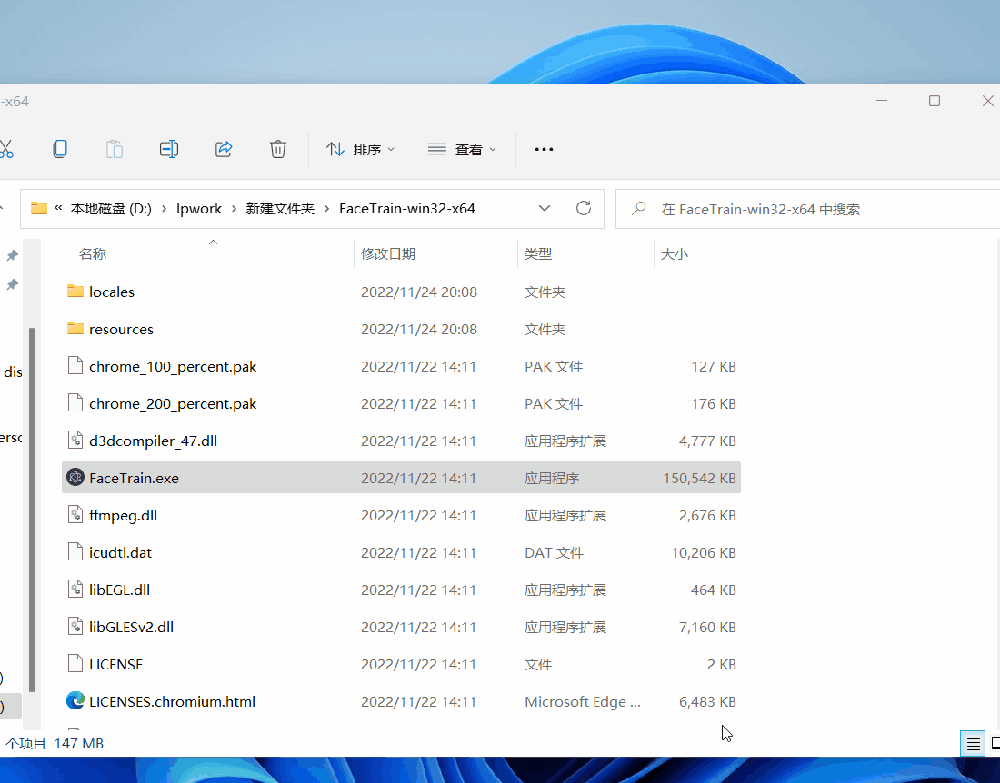
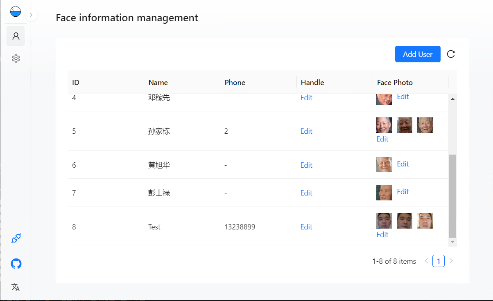

# ������ٿ�������ʶ����

- ʹ��opencv���õ�����ʶ���㷨
- �ɰ���������û�������Ϣά��
- һ�Զ�ʶ��ģ��ѵ��������xmlģ���ļ�
- ӵ�м򵥵IJ��Թ���
- ����webapi�ӿڷ����������������
- ǰ��React+���dotnetcore�����ƽ̨ʹ��
- ���electron����������Ԥ��
- �������ף����ѧ�������������

## �ϻ�������Ԥ��ͼ

 

## ��Ҫȥ���س���

[���������ˣ������ֽ�ס https://github.com/laolaolulu/FaceTrain/releases](https://github.com/laolaolulu/FaceTrain/releases)

## ���Ƿ����޸Ĵ���ʵ������Ҫ�Ĺ��ܣ�

- ǰ��ʹ��React������vue�в��У�����ȥѧϰ��React��ܼ򵥵ģ�
- ǰ�˽��ּ�ʹ�ð����umijs
- UI�⻹�ǰ����antd
- OpenApi-Swagger
- ���ʹ��VisualStudio2022���߿���
- .net core 6 webapi
- ����ʶ���㷨����OpenCvSharp

## ��ĿĿ¼����

- FaceTrain //��Ŀ¼
  - ClientApp //ǰ�˴���
  - Controllers //webapi������
  - electron //�������
  - Models //���ݿ�ģ�ͣ�EntityFramework��
  - Resource //������Դ
  - wwwroot
    - dist //ǰ��build����ļ�
    - Faces //��������ͼƬ
    - Model //ѵ��ģ�ʹ���Ŀ¼
  * face.db //���ݿ��ļ���sqlite��
  * lp.p12 //ssl֤�飨����web��������ͷ��

## ģ��ʹ��demo

- c#

`//������ `

- java

`//������ `

- python

`//������ `

- node

`//������ `

- c++

`//������ `

## ��Ҫ���б���

�ĵ�������

## ����

<<<<<<< HEAD

- ΢��DF�ã�
- # �ȸ�DF�ã�
- ΢��DF���ã�
- �ȸ�DF���ã�
  > > > > > > > af73f9616aac9e2861ef405c4505a0c760a04ecc

ÿһ�δ��붼���ܱ�֤û��bugϣ����ұ������ӭ�ύissues���п�ʱ��ȥ�����޸��� �������ɵ�ģ���ʺ���һ�Զ�����ʶ�����������Ҫһ��һ������ƥ����֤������߲��ʺϣ� LBPH�㷨ʶ����confidenceС��50���ܱ�֤ʶ���׼ȷ�ԣ�
